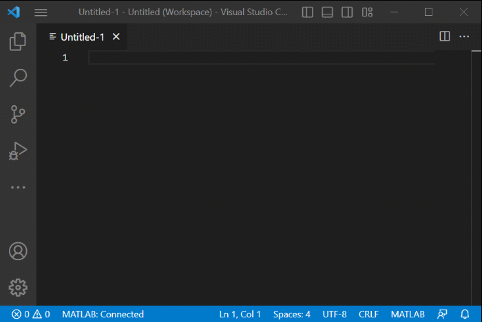
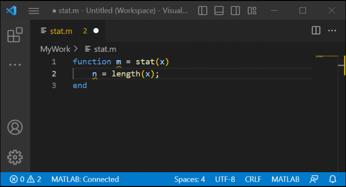

# MATLAB extension for Visual Studio Code
[](https://matlab.mathworks.com/open/github/v1?repo=mathworks/MATLAB-extension-for-vscode)

This extension provides support for editing MATLAB&reg; code in Visual Studio&reg; Code and includes features such as syntax highlighting, code analysis, navigation support, and more. 

You can use this extension with or without MATLAB installed on your system. However, to make use of the advanced code-editing features of the extension, you must have MATLAB R2021a or later installed. For more information, see the [Get Started](#get-started) section.

## Installation
You can install the extension from within Visual Studio Code or download it from [Visual Studio Code Marketplace](https://marketplace.visualstudio.com/items?itemName=MathWorks.language-matlab). After installing the extension, you might need to configure it to make full use of all the features. For more information, see the [Configuration](#configuration) section.

## Get Started
To get started using the extension, open any MATLAB code file, or create a new file and set the language to MATLAB.

### Basic Features (MATLAB not required)
The extension provides several basic features, regardless of whether you have MATLAB installed on your system. These features include:
* Syntax highlighting
* Code snippets
* Commenting
* Code folding



### Advanced Features (requires MATLAB installed on your system)
If you have MATLAB R2021a or later installed on your system, you have access to an additional set of advanced code-editing features. These features include:
* Automatic code completion
* Source code formatting (document formatting)
* Code navigation
* Code analysis, such as continuous code checking and automatic fixes



## Configuration
To configure the extension, go to the extension settings and select from the available options.

### MATLAB Install Path Setting
If you have MATLAB installed on your system, the extension automatically checks the system path for the location of the MATLAB executable. If the MATLAB executable is not on the system path, you may need to manually set the `matlab.installPath` setting to the full path of your MATLAB installation. For example, `C:\Program Files\MATLAB\R2022b` (Windows&reg;), `/Applications/MATLAB_R2022b.app` (macOS), or `/usr/local/MATLAB/R2022b` (Linux&reg;).

You can determine the full path of your MATLAB installation by using the `matlabroot` command in MATLAB. 

For example, run the `matlabroot` command in the MATLAB Command Window.
```
matlabroot
ans =
    'C:\Program Files\MATLAB\R2022b'

```
In the extension settings, set the `matlab.installPath` setting to the value returned by the `matlabroot` command.
```
matlab.installPath = "C:\Program Files\MATLAB\R2022b"
```

### MATLAB Index Workspace Setting
By default, the extension indexes all the MATLAB code files (`.m`) in your current workspace. Indexing allows the extension to find and navigate between your MATLAB code files. 
You can disable indexing to improve the performance of the extension. To disable indexing, set the `matlab.indexWorkspace` setting to `false`. Disabling indexing can cause features such as code navigation not to function as expected.

### MATLAB Connection Timing Setting
By default, the extension starts MATLAB in the background when you open a MATLAB code file in Visual Studio Code. To control when the extension starts MATLAB, set the `matlab.matlabConnectionTiming` setting to one of these values: 
* `onStart` (default) — Start MATLAB as soon as a MATLAB code file is opened.
* `onDemand` — Start MATLAB only when needed for a given action.
* `never` — Never start MATLAB.
Note: Some functionality is available only with MATLAB running in the background.

### MATLAB Telemetry Setting
You can help improve the extension by sending user experience information to MathWorks&reg;. By default, the extension sends user experience information to MathWorks. To disable sending information, set the `matlab.telemetry` setting to `false`.

For more information, see the [MathWorks Privacy Policy](https://www.mathworks.com/company/aboutus/policies_statements.html). 

## Troubleshooting
If the MATLAB install path is not properly configured, you get an error when you try to use certain advanced features, such as document formatting and code navigation.

To resolve the error, set the MATLAB install path to the location of the MATLAB executable. For more information, see the [Configuration > MATLAB Install Path Setting](#matlab-install-path-setting) section.

## Contact Us
We encourage all feedback. If you encounter a technical issue or have an enhancement request, create an issue here or contact MathWorks at support@mathworks.com.

## Release Notes

### 1.1.0
Release date: 2023-06-5

Added:
* Document symbol and outline support

Fixed:
* Code folding no longer matches `end` when used in strings, comments, and to denote the end of a matrix

### 1.0.0
Release date: 2023-04-26

* Initial release.